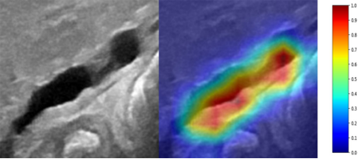
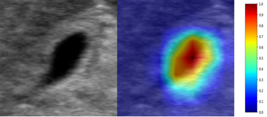

# Sonographic Gallbladder Diagnose System


[](https://doi.org/10.5281/zenodo.4445474)
[](https://doi.org/10.5281/zenodo.4445734)


# Content
- [Overview](#overview)
- [System Requirements](#system-requirements)
- [Demo](#demo)
- [Result of CAM](#result-of-cam)
- [Result](#result)
- [License](#license)

# Overview
It is still difficult to make accurate diagnosis of biliary atresia (BA) by sonographic gallbladder images particularly in rural area without relevant expertise. To help diagnose BA based on sonographic gallbladder images, an ensembled deep learning model was developed. With the help of the model, the performance of human experts with various levels would be improved further. Moreover, the diagnosis based on smartphone photos of sonographic gallbladder images through a smartphone app and based on video sequences by the model still yielded expert-level performances. In this work, the ensembled deep learning model provides a solution to help radiologists improve BA diagnosis in various clinical application scenarios, particularly in rural and undeveloped regions with limited expertise. 

# System Requirements
## Hardware requirements
The source code require at lest 6GB GPU memory to support it to work.

## Software requirements
### OS Requirements
This package is supported for *Windoes* and *Linux*. The package has been tested on the following systems:
+ Windows: Microsoft Windows 10 Pro
+ Linux: Ubuntu 18.04

### Python Dependencies
The following python pakage are required :

```
pytorch
torchvision
numpy
sklearn
tensorboardX
PIL
tqdm
SimpleITK
pandas
pretrainedmodels
efficientnet_pytorch
matplotlib
```

# Demo
## start to run
The defult hyperparameter was set on `./src/tool.py`, and its can be also reset on `/script/run.sh`, You can enter `python run.sh` in the terminal to run the code.

# Result of CAM
In our study, we used **the class activation map (CAM)** technology to explain on which region(s) the model focus. 

---

<p align="center">

 
</p>

---

# Result
The model yields a patient-level sensitivity **93.1%** and specificity **93.9%** \[with areas under the receiver operating characteristic curve of **0.956** (95% confidence interval: 0.928-0.977)] on the multi-center external validation dataset, superior to that of human experts.

# License
This project is covered under the **MIT** License.

